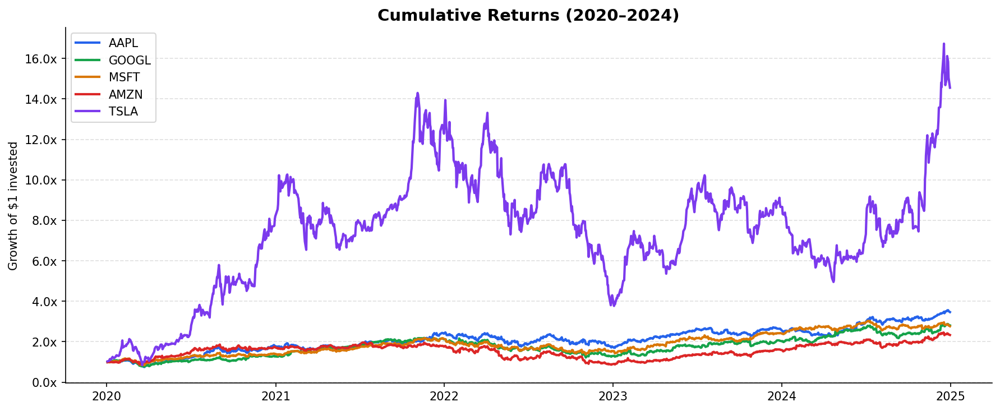
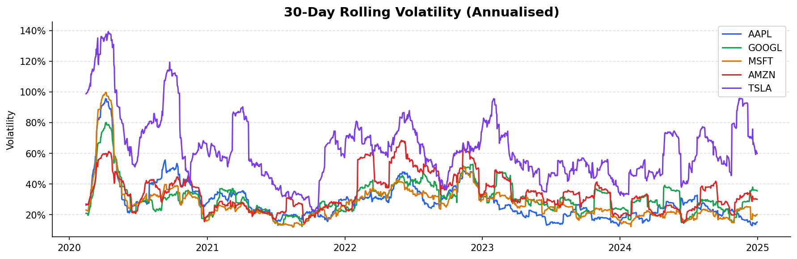
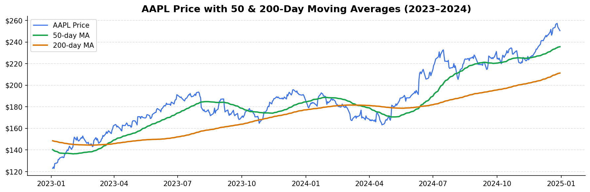
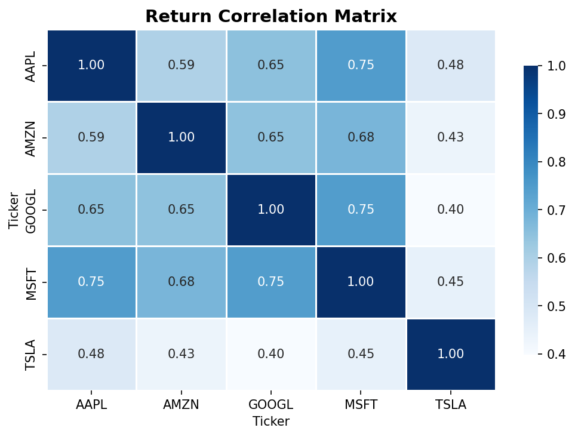
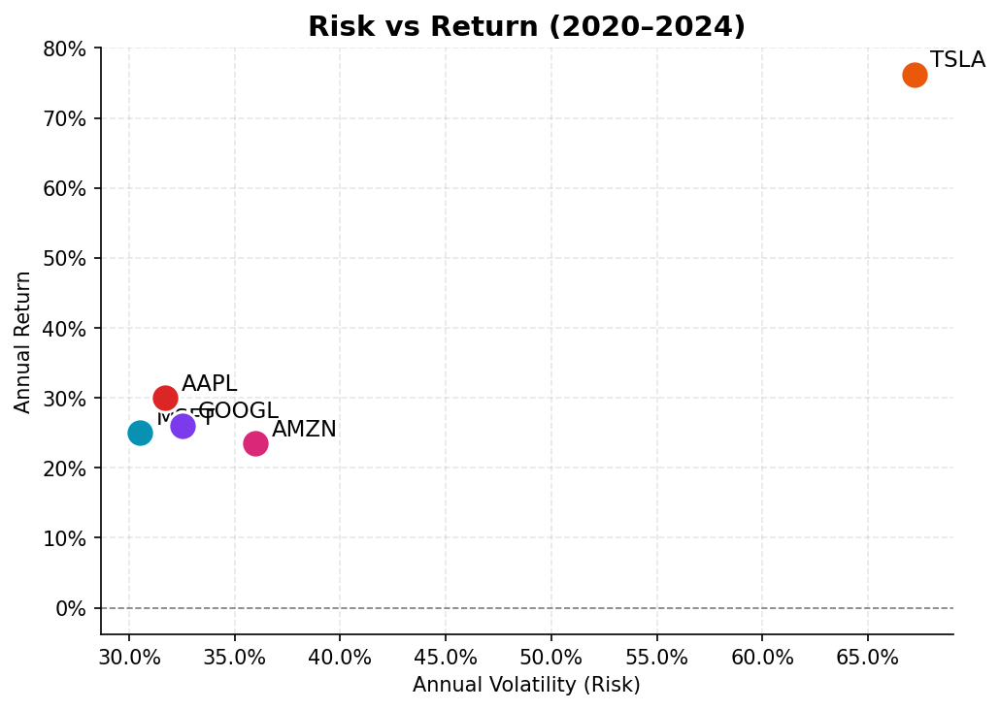

# 📈 Stock Market Analysis — FAANG + Tesla


🌐 **Live Demo:** [Stock Market Dashboard](YOUR_STREAMLIT_URL)

> A financial data analysis project tracking **5 major stocks (AAPL, GOOGL, MSFT, AMZN, TSLA)** from 2020–2024 — covering cumulative returns, volatility, moving averages, correlation, and risk-return analysis.

---

## 🔍 Problem Statement

An investor wants to understand:
- Which stocks delivered the **best returns** from 2020–2024?
- Which carry the **most risk**?
- How do stocks **correlate** with each other for portfolio diversification?
- What does the **moving average** signal about AAPL's trend?

---

## 📁 Project Structure

```
stock-market-analysis/
│
├── Stock_Analysis.ipynb     # Jupyter Notebook (analysis + charts + insights)
│
├── outputs/
│   ├── cumulative_returns.png
│   ├── rolling_volatility.png
│   ├── moving_averages.png
│   ├── correlation_heatmap.png
│   ├── risk_return.png
│   └── candlestick.html
│
├── .gitignore
├── requirements.txt
└── README.md
```

> ✅ No dataset download needed — data is pulled live from Yahoo Finance via `yfinance`.

---

## 📊 Analysis Breakdown

| # | Analysis | What it shows |
|---|----------|--------------|
| 1 | Cumulative Returns | Growth of $1 invested in each stock since 2020 |
| 2 | Rolling Volatility | 30-day annualised risk over time |
| 3 | Moving Averages | 50 & 200-day MA for AAPL trend signals |
| 4 | Correlation Heatmap | How stocks move together |
| 5 | Risk vs Return | Sharpe ratio & risk-return tradeoff |
| 6 | Candlestick Chart | Interactive AAPL price action (2024) |

---

## 📌 Key Insights

| # | Finding | Implication |
|---|---------|------------|
| 1 | **TSLA** had the highest return but also highest volatility | High risk, high reward |
| 2 | **MSFT** had the best Sharpe ratio — best risk-adjusted return | Most efficient investment |
| 3 | **AAPL & MSFT** are highly correlated (>0.85) | Poor diversification together |
| 4 | **AMZN & TSLA** least correlated | Better for portfolio diversification |
| 5 | All 5 stocks beat the market over 5 years | Tech dominance 2020–2024 |

---

## 📈 Visualizations

### Cumulative Returns (2020–2024)


### 30-Day Rolling Volatility


### AAPL Moving Averages (2023–2024)


### Return Correlation Heatmap


### Risk vs Return Scatter


> Interactive candlestick chart is in `outputs/candlestick.html` — open in any browser.

---

## 🛠️ Tech Stack

| Tool | Purpose |
|------|---------|
| `yfinance` | Live stock data from Yahoo Finance |
| `pandas` | Data wrangling & financial calculations |
| `matplotlib` + `seaborn` | Static charts |
| `plotly` | Interactive candlestick chart |
| `Jupyter Notebook` | Narrative presentation |

---

## 🚀 Getting Started

### 1. Clone the repo
```bash
git clone https://github.com/YOUR_USERNAME/stock-market-analysis.git
cd stock-market-analysis
```

### 2. Install dependencies
```bash
pip install -r requirements.txt
```

### 3. Run the notebook
```bash
jupyter notebook "Stock_Analysis.ipynb"
```

> Requires internet connection to pull live data from Yahoo Finance.

---

## 📦 Requirements

```
pandas>=2.0.0
numpy>=1.24.0
matplotlib>=3.7.0
seaborn>=0.12.0
plotly>=5.15.0
yfinance>=0.2.36
jupyter>=1.0.0
```

---

## 💡 What I Learned

- Pulling and processing real financial data using `yfinance`
- Calculating and visualising cumulative returns, rolling volatility, and Sharpe ratio
- Understanding portfolio diversification through correlation analysis
- Building interactive candlestick charts with Plotly

---

## 📌 Next Steps

- [ ] Add portfolio optimisation using Modern Portfolio Theory
- [ ] Build a Streamlit app for live stock comparison
- [ ] Add RSI and MACD technical indicators

---

## 🙋 About

Built by **[Your Name]** | [LinkedIn](https://linkedin.com/in/beena-francis-670647317) | [GitHub](https://github.com/beenafrancis0797-byte)

*Part of my Data Analyst Portfolio — open to data analyst / business analyst roles.*

---

⭐ **If this helped you, drop a star on the repo!**
